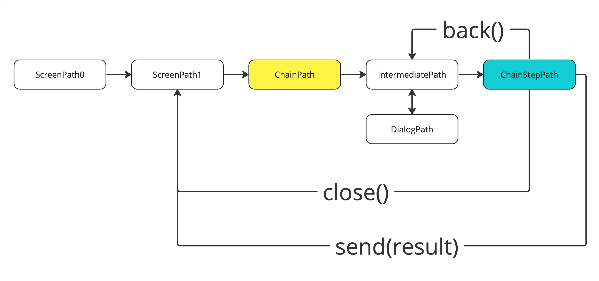

# Chains

A chain is a sequence of screens connected by specific logic. It can represent a wizard with steps like step0, step1, step2, and so on. When the `close` method is invoked by any of the entries, the entire chain closes.

You can define a chain of screens in the RouteController using the `@Chain` annotation. It has one parameter that specifies the paths which close the chain.

It's important to note that calling the `back` method doesn't close a chain.

```kotlin
data class ChainPath(val step: Int): RoutePathResult<Int>

@Chain([ChainStepPath::class])
@Route
abstract class ChainRouteController: RouteControllerApp<ChainPath, ChainViewModel, ChainFragment>()
{
    override fun onCreateViewModel(modelProvider: AndroidViewModelProvider, path: ChainPath): ChainViewModel =
        modelProvider.getViewModel { ChainViewModel(path.step, it) }
}
```

If you want to explore a comprehensive example, you can refer to the sample-fragment package. It provides a detailed illustration of the concepts discussed, allowing you to see the implementation in action.

## Scheme

<figure><figcaption><p>Short scheme of how chain works</p></figcaption></figure>
