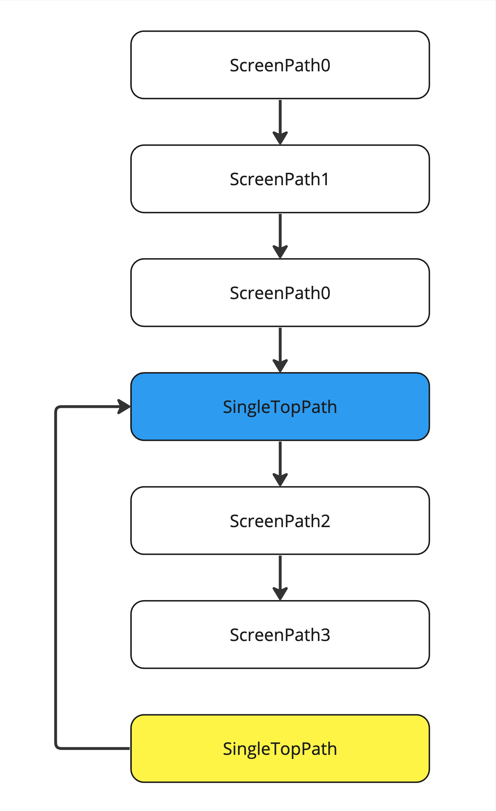

# SingleTop

The `@Route` annotation has a singleTop property that instructs the Router to maintain only one instance of the screen in the screens hierarchy. When you call `router.route(SingleTopPath())`, if an instance of this path already exists in the current hierarchy, the Router will close all screens above the existing instance of `SingleTopPath()` in the stack.

The `singleTop` property has three options:

1. **None**: This is the default value, indicating no single top behavior.
2. **Class**: Path equality is determined by the equality of their classes. That is, path0::class == path1::class.
3. **Equal**: Path equality is determined by the equals method. That is, path0 == path1.

## Simple case

Let’s take a look at a simple example. Imagine our views stack looks like the picture below, which includes a `SingleTopPath` (blue rectangle). Now, we want to add another `SingleTopPath` (yellow rectangle) to the stack.

<figure><figcaption>
Try to add another one SingleTopPath item
</figcaption></figure>

The Router will find the existing instance of `SingleTopPath` in the stack.

<figure><figcaption>
Router found existing instance
</figcaption></figure>

And close all stack items above that instance. We will then have a resulting stack as shown in the picture below:

<figure><figcaption>
Resulting stack
</figcaption></figure>

## Tabs case

Let’s take a look at an example with tabs. We have the following hierarchy, where the active tab is TabPath1 (red rectangle). TabPath0 already contains a SingleTopPath instance in the middle of its stack (blue rectangle). Now, we want to navigate to the SingleTopPath (yellow rectangle).

<figure><figcaption>
Try to add another one SingleTopPath item
</figcaption></figure>

The Router will find the existing instance of `SingleTopPath` in the stack.

<figure><figcaption>
Router found existing instance
</figcaption></figure>

To navigate to the existing instance of `SingleTopPath`, the Router first changes the current tab to `TabPath0`, where SingleTopPath resides.

<figure><figcaption>
Change selected tab to TabPath0
</figcaption></figure>

And then close all stack items above that instance. We will then have a resulting stack as shown in the picture below:

<figure><figcaption>
Resulting stack
</figcaption></figure>

## Important

Tab paths can't have singleTop property other then None because they have their own similar behaviour.

